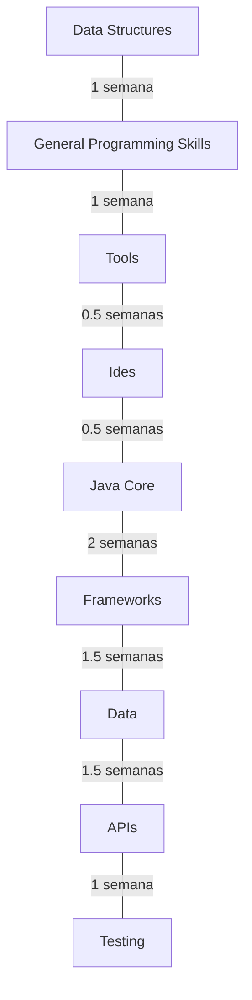

## My own roadmap - Java in 10 weeks

In this file we are going to look at tables, graphics and more about understanding more about the Java programming language.

## First steps - 3 weeks

- Data structures;
- General programming skills;
- Ides;
- Tools;

|Items|Priority(1 - 5)|Time(weeks)|
|:----|:-----|:-----|
|Data Structures|5|1|
|General programming skills|5|1|
|Tools|3|0.5|
|Ides|1|0.5|

*Data structures: arrays, sorting algorithms, hash tables, trees* 
 
*General programming: HTTP protocols, debugging, networking*
 
*Ides: NetBeans, Intellij*

## Second steps 7

- Java core;
- Frameworks;
- Data;
- APIs;
- Testing;

|Items|Priority(1 - 5)|Time(weeks)|
|:----|:-----|:-----|
|Java core|5|2|
|Frameworks|5|1.5|
|Data|5|1.5|
|APIs|4|1|
|Testing|3|1|

*Java core: collections, concurrency, JDKs* 
 
*Frameworks: Spring (Spring boot, Spring MVC, Spring Core, Spring Cloud, Spring WebFlux)*
 
*Data: SQL and NOSQL databases(SQLite, Postgress, NOSQL, MongoDB, DynamoDB)*
 
*APIs: REST, GraphQL, Messaging*
 
*Testing: Unit testing, Integration testing, E2E testing*

## In form of a diagram

