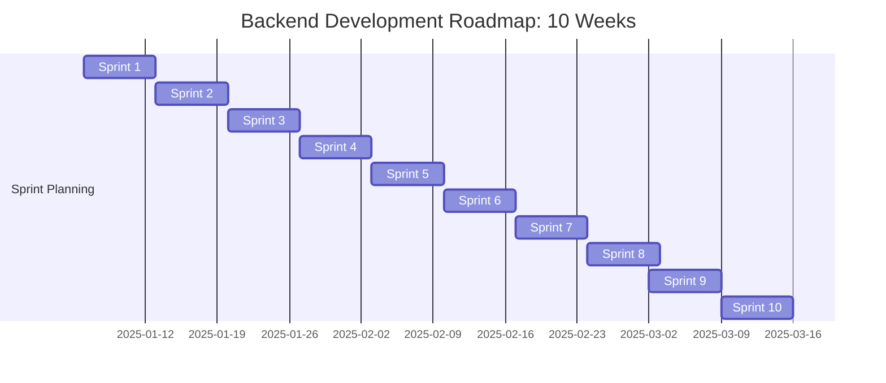

---
Backend Development Roadmap: 10 Weeks
---

## Introduction

This my 10-week roadmap. This is just planning my backend roadmap. While on the course, there will be react and devops projects and development.

---

## Sprint Planning

| Sprint | Start Date  | End Date    | Main Goal                             | Description                                                                                 | Expected Outcome                                    |
|--------|-------------|-------------|---------------------------------------|---------------------------------------------------------------------------------------------|-----------------------------------------------------|
| 1      | 06/01/2025  | 12/01/2025  | Database Fundamentals                 | Normalization, data modeling, basic SQL operations, and schema creation.                    | Design and implement a normalized database schema with 3 related tables. |
| 2      | 13/01/2025  | 19/01/2025  | Backend and SQL Integration           | Connect Spring Boot to an SQL database, creating a complete CRUD system.                    | Implement a CRUD system in Spring Boot, where the data is stored and retrieved from a MySQL database. |
| 3      | 20/01/2025  | 26/01/2025  | Practical Project 1: CRUD System      | Develop a system with authentication and data persistence using SQL.                         | Complete a working user authentication system with JWT and basic CRUD functionality in the backend. Finish Scrum book |
| 4      | 27/01/2025  | 02/02/2025  | Advanced SQL Fundamentals             | Learn indexing, query optimization, and ACID transactions.                                  | Optimize at least 3 SQL queries with indexing and explain how each optimization improves performance. |
| 5      | 03/02/2025  | 09/02/2025  | Introduction to NoSQL Databases       | Understand document-based databases (MongoDB) and use cases for NoSQL databases.             | Set up a MongoDB database with at least 2 collections and implement basic queries. |
| 6      | 10/02/2025  | 16/02/2025  | Practical Project 2: NoSQL System     | Implement a system using Redis and MongoDB, exploring caching and scalability.              | Build a simple chat application with Redis caching and MongoDB for storing messages. |
| 7      | 17/02/2025  | 23/02/2025  | System Design                        | Concepts of scalability, microservices, high availability, and API Gateway.                 | Design a scalable microservices architecture with at least 2 services communicating via REST API. |
| 8      | 24/02/2025  | 01/03/2025  | Review of Fundamentals and Testing   | Review design principles, test integration, and refine previous projects.                   | Perform unit and integration tests on previous projects, and document testing strategies used. |
| 9      | 02/03/2025  | 08/03/2025  | Deployment on AWS                    | Set up EC2, RDS, S3, and analyze different deployment strategies.                           | Deploy a Spring Boot application on EC2 with a MySQL database on RDS, and a static website hosted on S3. |
| 10     | 09/03/2025  | 15/03/2025  | Finalization and Deployment Comparison | Compare deployment options (Heroku, Docker, Kubernetes) and document the learning process.   | Create a comprehensive comparison of Heroku, Docker, and Kubernetes deployment options for a Spring Boot application. Finish Getting thigs done book|

---

## Project Roadmap

### Milestones

1. **Mastered Fundamentals**: Solid foundations of SQL and NoSQL by January 26, 2025.
2. **SQL CRUD Project**: Completed with authentication by January 26, 2025.
3. **NoSQL Project**: Functional system with Redis and MongoDB by February 16, 2025.
4. **Scalable Architecture**: Documented design of robust systems by February 23, 2025.
5. **Complete Deployment**: Functional application with documented deployment options by March 15, 2025.

### Main Deliverables

- Complete diagrams (UML and Architecture).
- CRUD application with SQL.
- System with Redis and MongoDB.
- Scalable design documentation.
- Practical multi-platform deployment guide.
- Read Scrum book.
- Read Getting things done book.

### Visual representation: Mermaid Graph


---

## Resources

### Useful Links

- [UML Tutorial](https://www.tutorialspoint.com/uml/index.htm)
- [Spring Boot Docs](https://spring.io/projects/spring-boot)
- [MongoDB Manual](https://docs.mongodb.com/manual/)
- [Redis Documentation](https://redis.io/documentation)
- [AWS Docs](https://aws.amazon.com/documentation/)
- [System Design Primer](https://github.com/donnemartin/system-design-primer)
- [Scrum The art of doing twice the work in half the time](https://albertprofe.dev/books/scrum.html)
- [Getting Things Done](https://albertprofe.dev/books/gettingthingsdone.html)

### Code Example

```java
public class HelloWorld {
    public static void main(String[] args) {
        System.out.println("Hello, World!");
    }
}
```

*This file was made with the help of ChatGPT*
